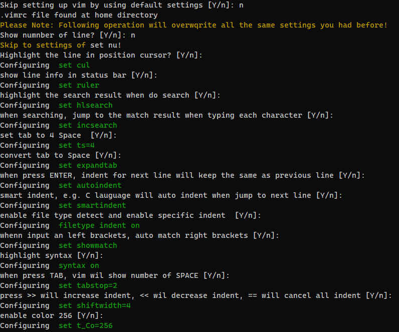

# Post-OOBE

## About
A Debian Package which packaging individual settings, resources and scripts for rapid setup when moving to a new machine.  
Simply migrate individual settings and environment from one system to another after OOBE, by installing the package
and choose the appropriate option.

## Requirements
OS: Ubuntu 18.04 and later version (Other systems and Versions are not guaranteed works)

> **Note:** 
> - *All dependencies will be installed automatically by using aptitude (apt-get) commands (See Installation for more details). We recommend you install the Post-OOBE in this way*
> - *Manually install all dependencies through the command line in 'Terminal' by using the command 'sudo apt install PACKAGE-NAME'*

## Installation
- sudo add-apt-repository ppa:$PPA-ADDRESS-TBD
- sudo apt-get update
- sudo apt install post-oobe

## Feature list
- Configure Vim / apply default Vim settings
- 

## Release Note (Change log)
- 0.0.1-alpha
	- Initial release of the package
- 0.0.2-alpha
	- Add support to overwrite the default vim settings
- 1.0.0
	- Add support of using default settings for vim and custom settings

